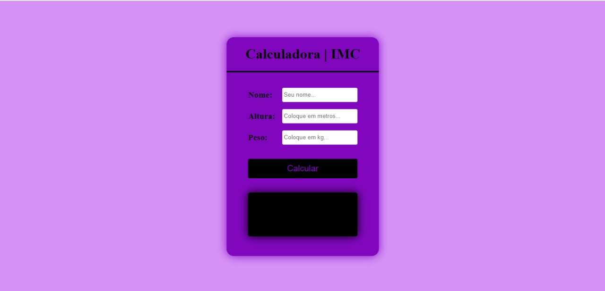
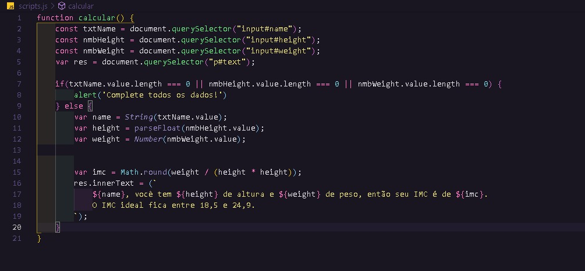

# Calculadora de IMC

Bom, estava procurando ideias de projetos para treinar meu JavaScript e encontrei este na web. Fui fazer e saiu melhor do que eu esperava!

## Como ocorreu:

Fiz o design (inspirado no da web) e mudei cores e medidas para a que me agradava melhor... Utilizei HTML e CSS puro

Após conseguir deixar como queria, fui para a mente da coisa.
Como a fórmula é pequena, apenas peguei os inputs, armazenei na variável, validei os dados e joguei na fórmula. Utilizei Math.round no resultado para não ficar muito confuso.

